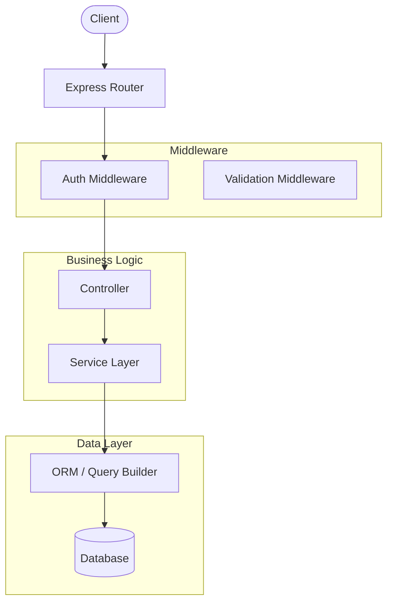

# Backend Review Skill

When a user requests an explanation of backend files, architecture, or code flow, **always produce a visual flowchart alongside the written explanation**. Never give a text-only explanation when a diagram would add clarity.

---

## Step 1 — Understand the Backend

Before generating a diagram, build a mental model:

1. **Identify what's present**: entry points (main.py, index.js, server.ts, app.py, etc.), routers/controllers, services/business logic, models/schemas, middleware, database layer, external integrations
2. **Trace the request lifecycle**: How does a request enter the system? What layers does it pass through? What does it return?
3. **Note key relationships**: which modules depend on which, shared utilities, config/env usage

If the user uploads files or pastes code, read them carefully. If they describe a system vaguely, ask one focused question to clarify scope (e.g., "Should I focus on the API request flow, the data model relationships, or the full architecture?").

---

## Step 2 — Detect Environment & Generate the Visual Flowchart

**First, determine which environment you're in:**

| Signal | Environment |
|---|---|
| `show_widget` / `visualize:show_widget` tool is available | **claude.ai** → use inline SVG widget |
| Running inside Claude Code (CLI), no `show_widget` tool | **Claude Code** → use Mermaid file + optional HTML |

---

### Diagram Types (pick the best fit regardless of environment)

| Situation | Diagram type |
|---|---|
| Request goes through multiple layers (route → controller → service → DB) | **Vertical flow** |
| Multiple services / microservices interacting | **System architecture** |
| Data model relationships | **Entity-relationship** |
| State machine / auth flow / middleware chain | **Swimlane** |

---

### Environment A: claude.ai — Inline SVG via `show_widget`

Call `read_me` with `["diagram"]` first to get CSS variables, then call `show_widget`.

**Style rules:**
- Use CSS variables for all colors (`var(--text-primary)`, `var(--bg-secondary)`, etc.)
- Nodes: rounded rectangles (`rx="8"`), diamonds for decisions, cylinders for DBs
- Arrows: `<marker>` arrowheads with edge labels
- Group layers with subtle background boxes
- Target ~700×500px viewBox

```svg
<svg viewBox="0 0 700 520" xmlns="http://www.w3.org/2000/svg" font-family="system-ui, sans-serif">
  <defs>
    <marker id="arrow" markerWidth="10" markerHeight="7" refX="10" refY="3.5" orient="auto">
      <polygon points="0 0, 10 3.5, 0 7" fill="var(--text-secondary)" />
    </marker>
  </defs>
  <rect x="10" y="10" width="680" height="500" rx="12" fill="var(--bg-secondary)" stroke="var(--border-color)" stroke-width="1"/>
  <!-- Nodes and arrows customised to the actual backend -->
</svg>
```

---

### Environment B: Claude Code — Mermaid file (primary) + HTML (optional)

**Primary: write a `.md` file with a Mermaid diagram block.**

Mermaid renders natively in VS Code (with Markdown Preview Mermaid Support), GitHub, and Obsidian — the most common Claude Code environments.

Use `create_file` to write `backend-diagram.md` into the project root (or wherever the user's docs live):

````markdown
# Backend Architecture


````

**Mermaid diagram type mapping:**

| Situation | Mermaid directive |
|---|---|
| Request lifecycle / layered flow | `flowchart TD` |
| Microservices / system map | `flowchart LR` |
| Data model relationships | `erDiagram` |
| Auth / state machine | `stateDiagram-v2` or `sequenceDiagram` |

**Optional: also write an `backend-diagram.html`** if the user wants a self-contained browser view (no VS Code extension needed). Use an inline `<script src="https://cdn.jsdelivr.net/npm/mermaid/dist/mermaid.min.js">` and a `<div class="mermaid">` block with the same diagram source. Tell the user: *"Open `backend-diagram.html` in any browser to view the diagram."*

After writing the file(s), tell the user where to find them and how to render (e.g., "Open `backend-diagram.md` in VS Code with Markdown preview, or open `backend-diagram.html` in your browser").

---

## Step 3 — Written Explanation

After the diagram, provide a structured written explanation:

```
### How It Works

**Entry Point**
[Describe where requests/processes begin]

**[Layer 1 Name]** (e.g., Routing / API Layer)
[What it does, key files, responsibilities]

**[Layer 2 Name]** (e.g., Business Logic / Services)
[What it does, key files, responsibilities]

**[Layer 3 Name]** (e.g., Data Layer / Models)
[What it does, key files, responsibilities]

**Key Data Flows**
- [Flow A: describe in one sentence]
- [Flow B: describe in one sentence]
```

Keep explanations concise. The diagram carries the structural weight — prose fills in context and nuance.

---

## Step 4 — Offer to Drill Down

End with a brief offer to go deeper:

> "Want me to zoom in on any specific part — like the auth middleware, a particular route, or the database schema?"

---

## Examples of What to Diagram

### Express/Node.js API
`Client → Express Router → Middleware (auth, validation) → Controller → Service → Prisma/Mongoose → DB`

### FastAPI / Django
`Request → URL Router → View/Endpoint → Pydantic validation → Service layer → ORM → PostgreSQL`

### Microservices
`API Gateway → [Service A, Service B, Service C] → Message Queue → Worker → DB`

### Auth Flow
`Login request → Validate credentials → Generate JWT → Return token → [Subsequent requests: verify JWT middleware → proceed or 401]`

---

## Tips

- For large codebases, diagram the **most important flow first** (usually the main request lifecycle), then offer to diagram sub-systems
- If the user shares only one file, focus on that file's internal flow and how it connects outward
- Use color coding / subgraph grouping: one visual group per layer (routing, logic, data)
- **claude.ai**: always call `read_me` with `["diagram"]` before `show_widget` to get current CSS variables
- **Claude Code**: default to `backend-diagram.md` (Mermaid); add the HTML file too if the user seems unlikely to have a Mermaid-aware editor
- If unsure of environment, check for `show_widget` tool availability — if absent, you're in Claude Code